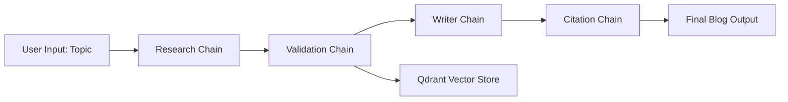

# Introduction

The **AI News Generator** is a personal project I built to explore autonomous LLM agents and multi-step pipelines using **LangChain**. The goal is simple: given a topic, generate a well-structured blog article that is **fact-checked**, **cited**, and **exportable**.

The system uses **LangChain chains** to simulate editorial roles — research, validation, writing, and citation. It's deployed with **Streamlit**, uses **OpenRouter** for model access, and **Qdrant** as a vector memory for validated facts.

[Live Demo →](https://langchain-ai-news-generator.streamlit.app/)

---

# Motivation

I wanted to build something that mimics how a research team works:  
> Researcher → Fact-Checker → Writer → Editor

Rather than relying on a single prompt, this pipeline architecture distributes responsibility to different chains. This improves **control**, **traceability**, and **explainability** — important for factual writing and reducing hallucinations.

This was also a hands-on way to explore **LangChain agents**, **multi-model inference**, and the tradeoffs in real-world deployment (especially with memory backends like ChromaDB vs Qdrant).

---

# Architecture



Each chain is an independent LangChain `LLMChain` with its own prompt template and input/output format. Agents communicate only through their intermediate results, keeping the design modular and testable.

---

# Tools & Models

| Component     | Description |
|---------------|-------------|
| **LangChain** | Orchestrates multi-step chains with prompt templating |
| **Streamlit** | Frontend UI for interacting with the pipeline |
| **OpenRouter** | Model access for Mistral, Gemma, etc. |
| **Qdrant** | Stores validated facts as retrievable vectors |
| **Tavily / Wiki** | Used for external search sources |
| **ReportLab / python-docx** | Generates PDF and DOCX downloads |

You can switch between models like **Mistral Small 3.1** or **Gemma 3** from the UI. More models via OpenRouter can be added easily.

---

# Workflow

```text
1. User enters a topic
2. Research Chain uses Tavily + Wiki to gather raw data
3. Validation Chain filters and fact-checks the results
4. Validated facts are stored in Qdrant
5. Writer Chain generates a readable blog draft
6. Citation Chain rewrites with inline references
7. Blog is shown on screen and exportable as PDF or DOCX
```

This flow mimics an editorial workflow, with clear responsibilities per stage.

---

# Challenges

The hardest part? **Deployment + Memory**.

Initially, I used **CrewAI** with **ChromaDB** — great for local testing, but not deployable on Streamlit Cloud due to Chroma's limitations. I tried switching CrewAI to use Qdrant, but found it still had tight coupling with Chroma internally.

So I rebuilt everything using **LangChain + Qdrant**, which gave me better deployment stability and memory flexibility. It also made the app easier to extend (e.g., adding new chains or models).

Other challenges:

- **Rate limits** on OpenRouter’s free models
- Handling long context windows
- Designing prompt templates that pass clean outputs between chains

---

# Key Learnings

- Multi-agent systems are **modular but fragile** — small bugs in one chain can snowball
- Vector memory is powerful but must be tuned to avoid duplicate retrievals
- UI/UX in Streamlit can make or break the experience (fun facts while loading = user happiness)
- Model choice matters — some LLMs hallucinate more than others even with the same prompt

---

# Result

- 🧠 Clean chain architecture (no agent frameworks)
- ✅ Validated facts stored as long-term memory
- 📄 Exportable content for real-world use
- 🧪 Production-ready demo on Streamlit Cloud

---

# Future Plans

- Add document upload + summarization
- Fine-tune prompts per model (Gemma/Mistral perform differently)
- Add historical memory for previous topics via Qdrant filters

---
[View on GitHub →](https://github.com/malindard/langchain-ai-news-generator)
---

# Related Projects

**👉 Also check out:**  
A similar project built using **CrewAI** instead of **LangChain** — leaner agent execution, easier role setup, same great results, minus Streamlit. [Check the similar project →](https://github.com/malindard/multi-agent-ai-blog-generator)

> "Let the agents do the research — you just pick the topic."

---
